# Mermaid Mindmap Styling Examples

## Basic Mindmap

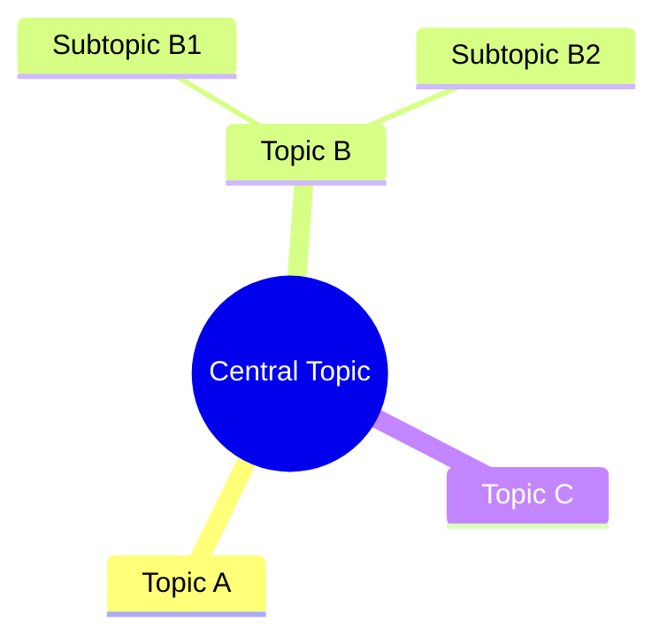

## Circle Nodes

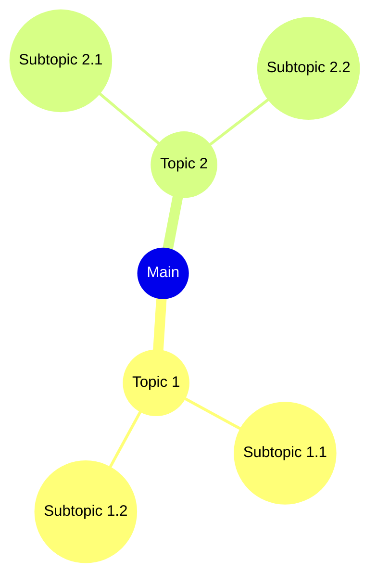

## Square Nodes

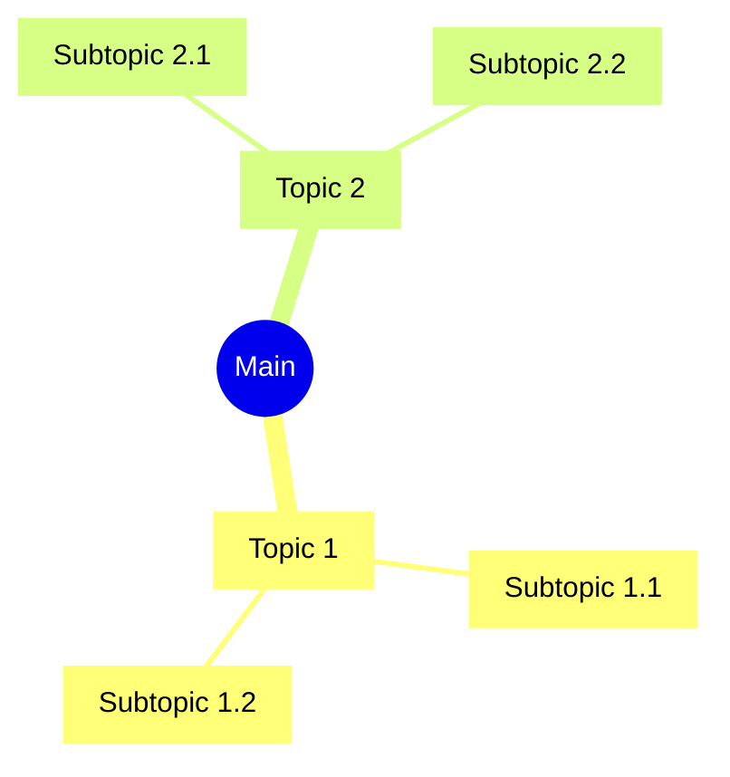

## Mixed Node Types

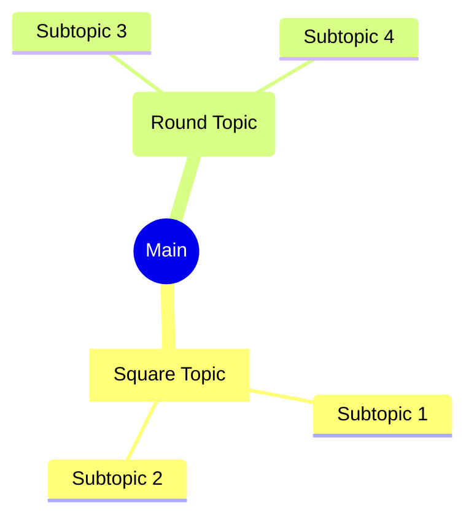

## Deep Hierarchy

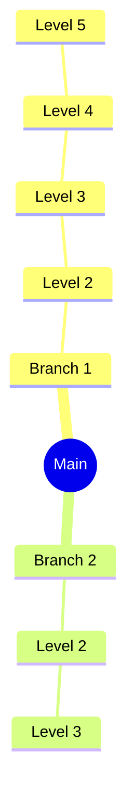

## With Emojis

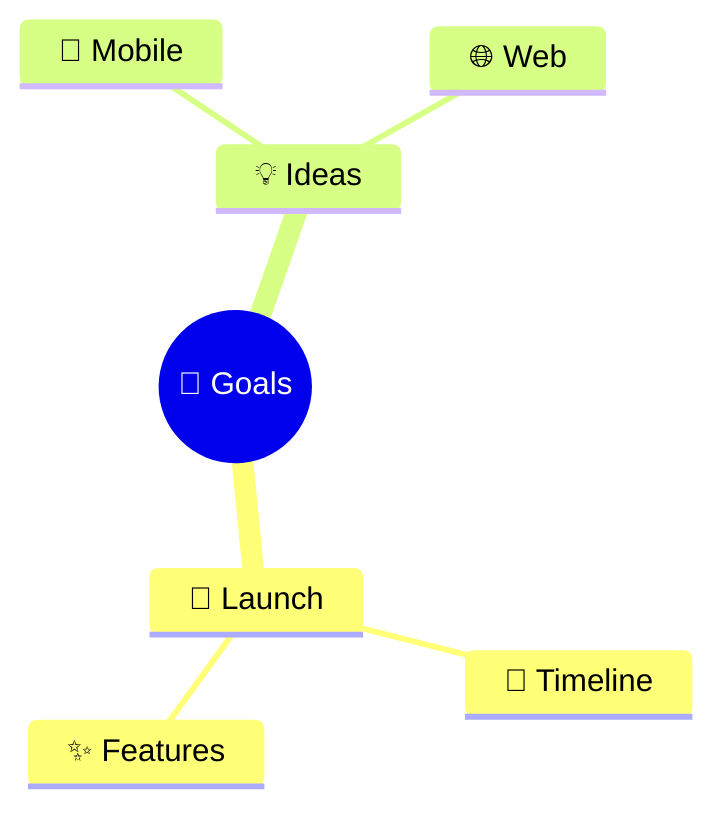

## Wide Structure

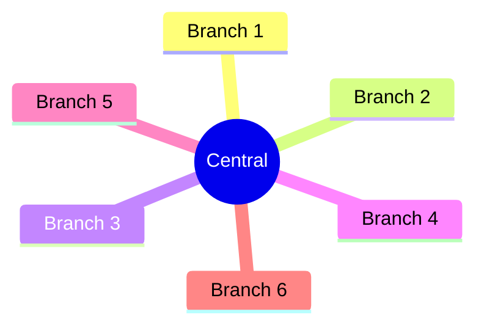

## Development Flow

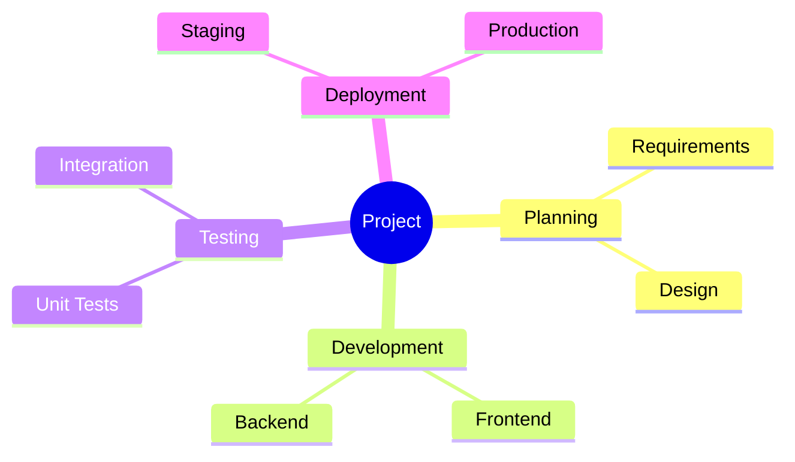

## Technology Stack

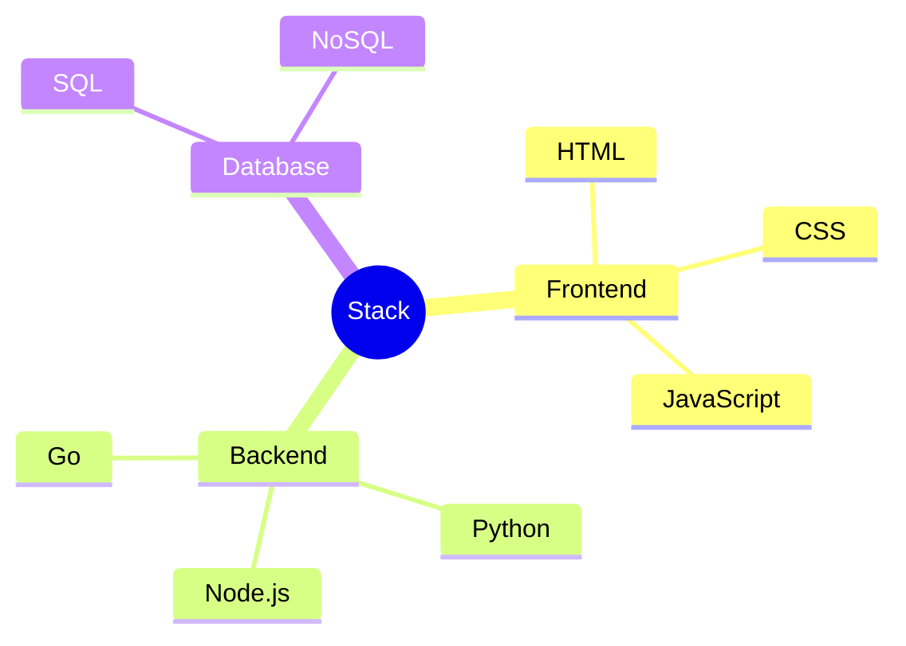

## Project Timeline

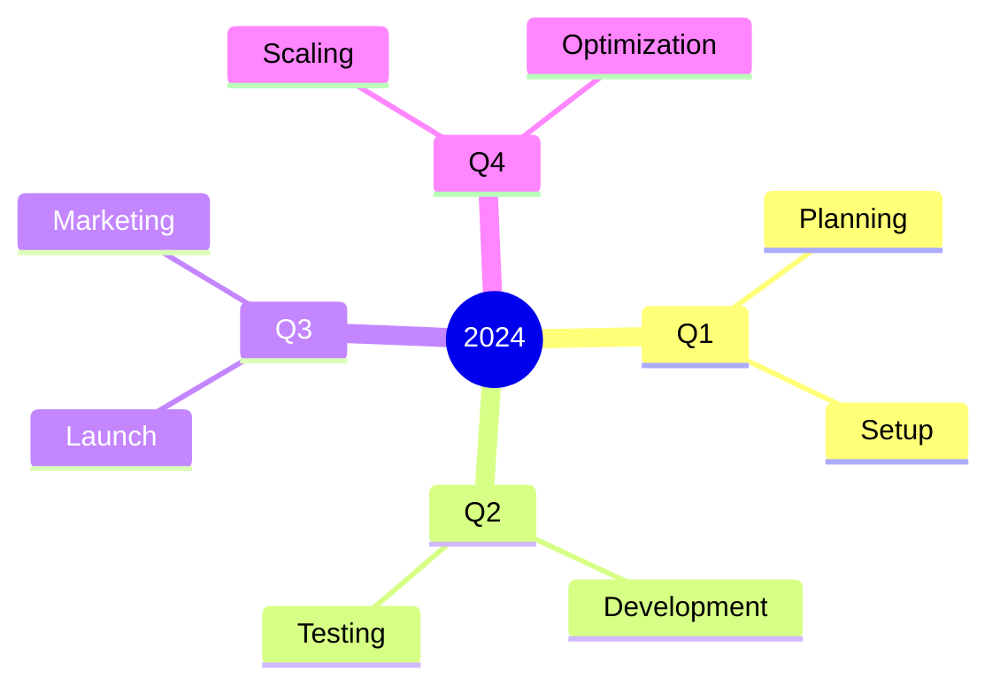

```

These examples all work reliably on GitHub as they use only the core supported features:
1. Basic node types: `(())`, `[]`, `()`
2. Plain text nodes (no brackets)
3. Emoji support
4. Hierarchical structures
5. Multiple branches
6. Deep nesting

Note that GitHub's Mermaid implementation doesn't support:
- Custom colors
- Themes
- CSS classes
- Custom fonts
- Layout direction control
- Icons (other than emojis)
- Advanced node shapes like `{{}}` or `>>`

Would you like me to show more examples of working combinations?
```

# Astound Project Development Flow

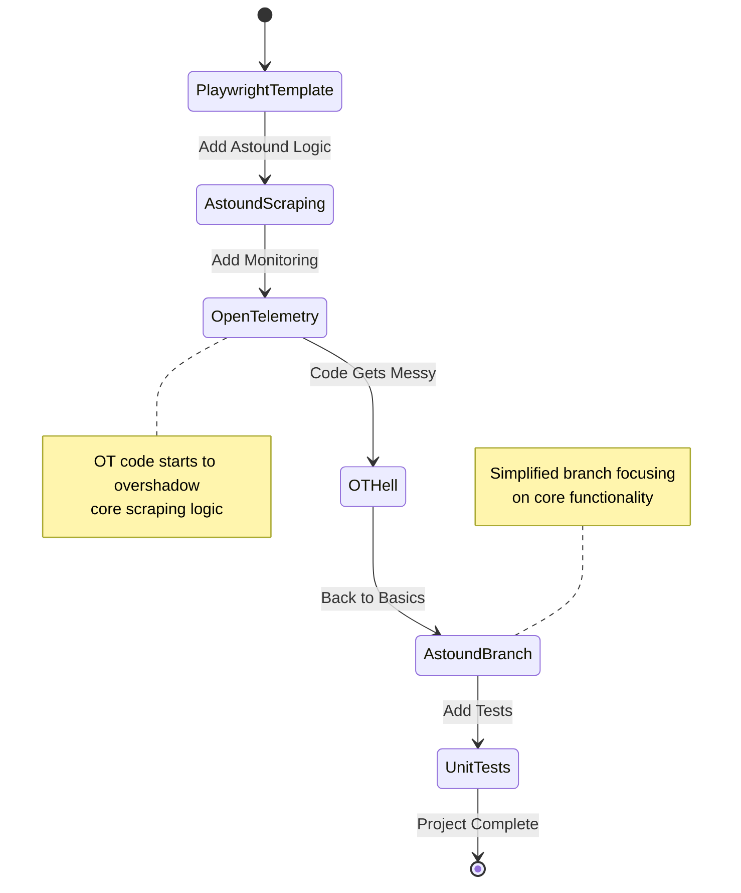
