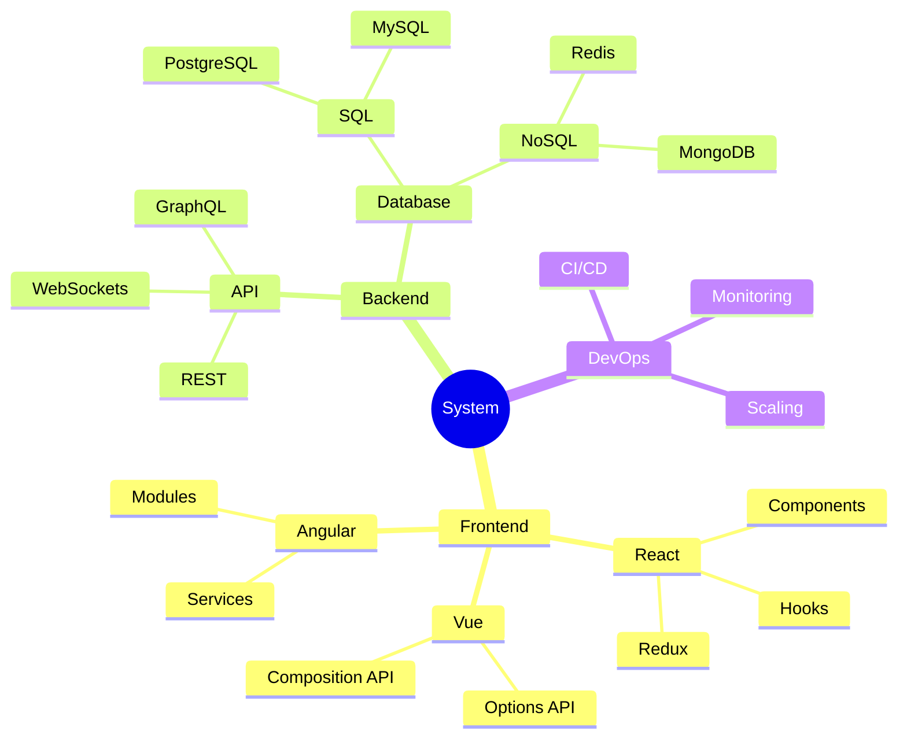
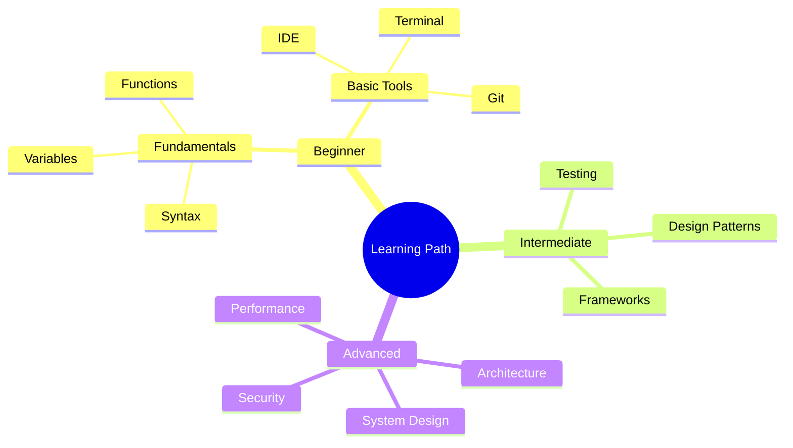
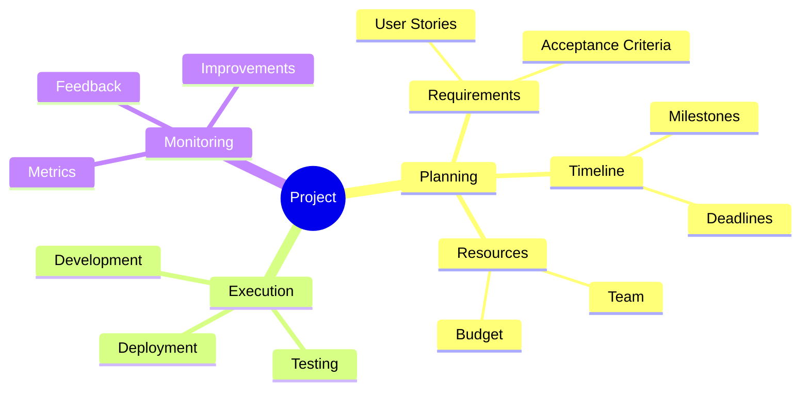
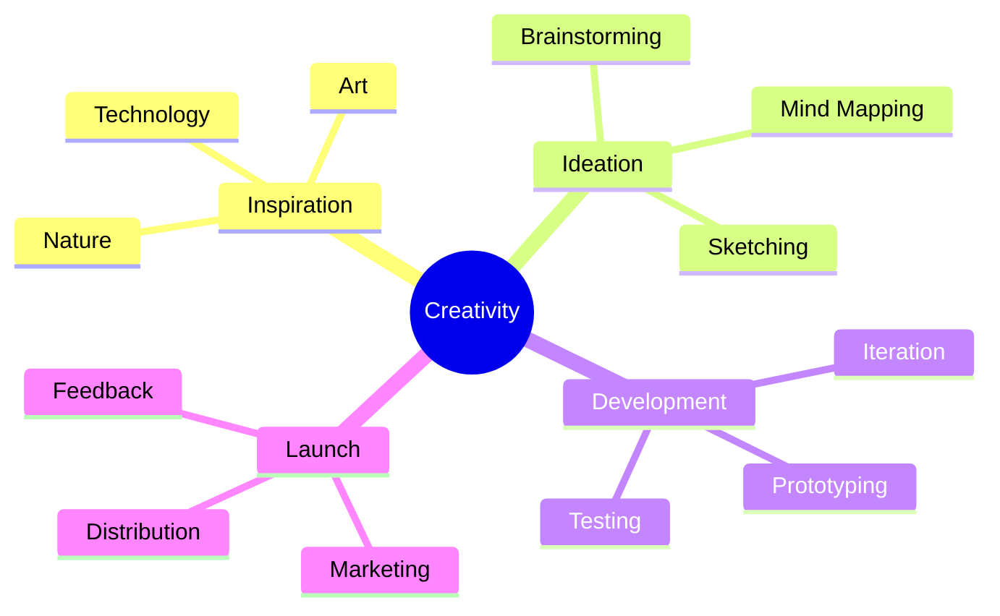
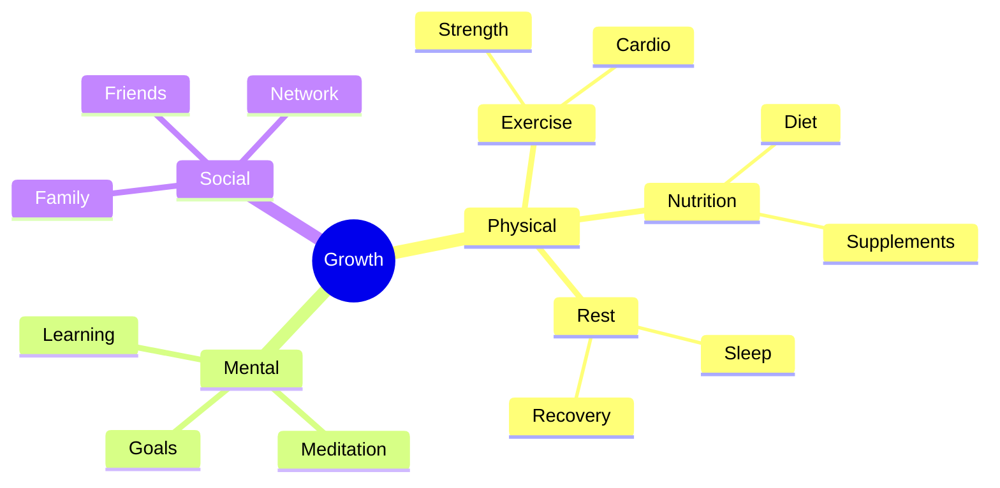
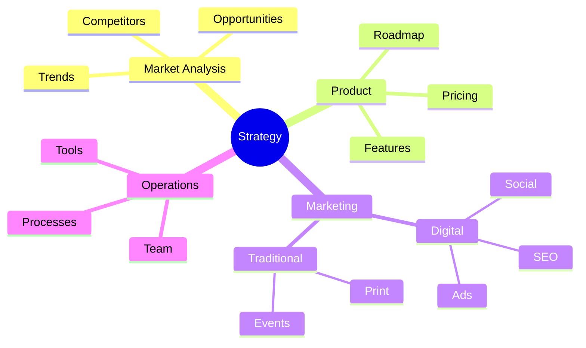
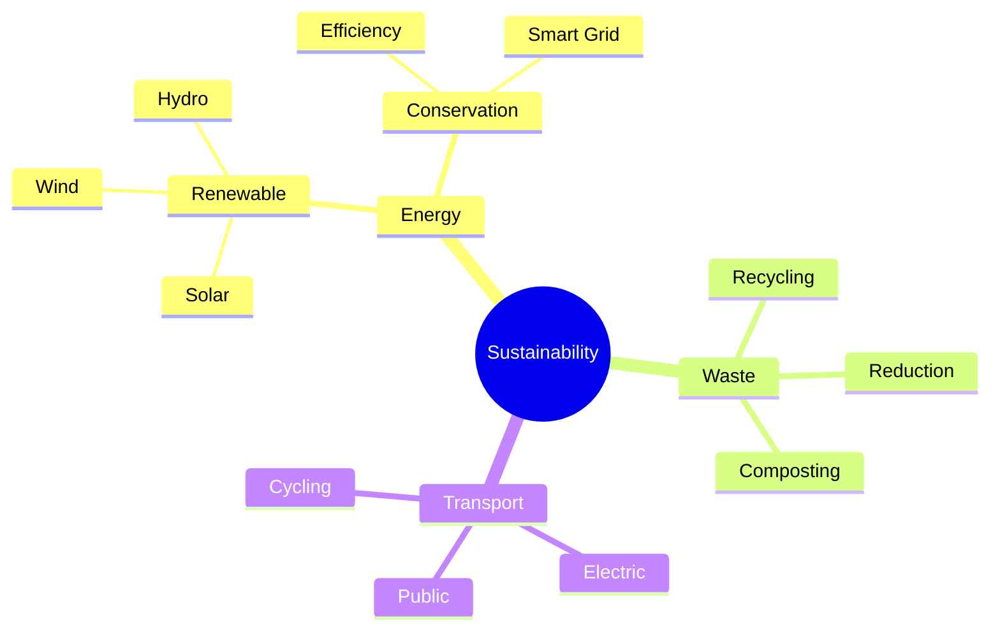
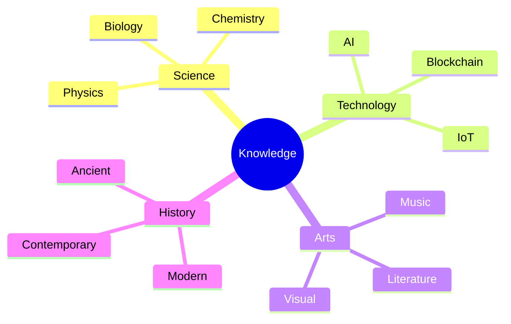
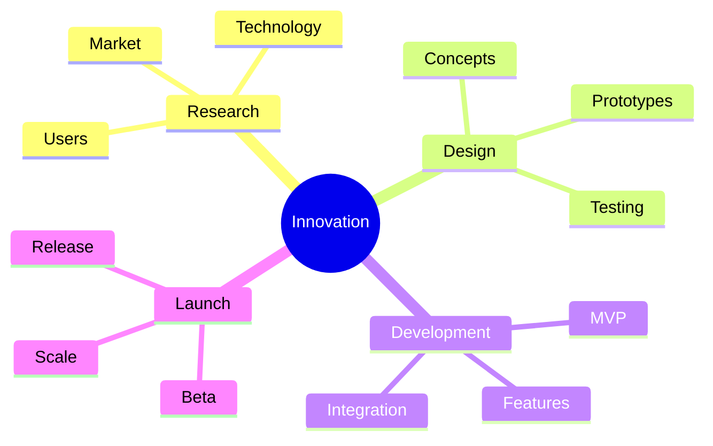
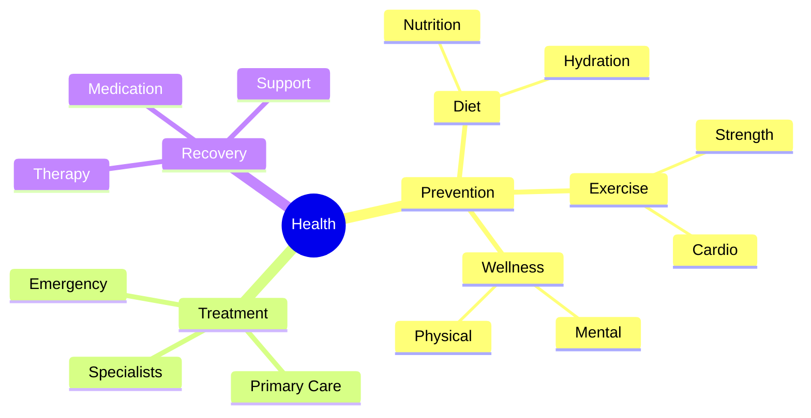

# Mind Map Inspiration Gallery

## Software Architecture



## Learning Journey



## Project Management



## Creative Process



## Personal Growth



## Business Strategy



## Environmental Impact



## Knowledge Base



## Innovation Pipeline



## Health System



```

```
