# Mermaid Mindmap Styling Guide

## Node Shapes
```mermaid
mindmap
    root((Circle))
        id[Square Bracket]
        id(Round Bracket)
        id((Double Circle))
        id))Curved((
        id{Curly}
        id{{Double Curly}}
```

## Colors and Formatting
```mermaid
%%{init: {'theme': 'base', 'themeVariables': { 'primaryColor': '#ffcccc', 'backgroundColor': '#ffffff', 'lineColor': '#ff0000'}}}%%
mindmap
    root((Styled Root))
        ::icon(fa fa-book)
        A[Colored]:::someclass
        B(Styled):::otherclass
        C((Node)):::specialclass

classDef someclass fill:#f96
classDef otherclass fill:#69f,stroke:#069
classDef specialclass fill:#fff,stroke:#333,stroke-width:4px
```

## Layout Directions


## Custom Themes


## Icons and Emojis

```mermaid
mindmap
    root((🎯 Project))
        📱 Mobile
            iOS
            Android
        💻 Web
            Frontend
            Backend
        🔧 Tools
            Git
            Docker
```


## Complex Styling Example
```mermaid
%%{init: {
  'theme': 'dark',
  'themeVariables': {
    'primaryColor': '#ff6b6b',
    'secondaryColor': '#4ecdc4',
    'tertiaryColor': '#45b7af',
    'mainBkg': '#2f3640',
    'nodeBorder': '#fff',
    'lineColor': '#fff',
    'fontSize': '14px'
  },
  'mindmap': {
    'padding': 15,
    'rankSpacing': 80,
    'nodeSpacing': 40
  }
}}%%
mindmap
    root((🚀 System)):::root
        Frontend:::frontend
            React:::tech
            Vue:::tech
        Backend:::backend
            API:::tech
            Database:::tech
        DevOps:::devops
            CI/CD:::tech
            Monitoring:::tech

classDef root fill:#ff6b6b,stroke:#fff,stroke-width:2px,color:#fff
classDef frontend fill:#4ecdc4,stroke:#fff,color:#000
classDef backend fill:#45b7af,stroke:#fff,color:#000
classDef devops fill:#2d3436,stroke:#fff,color:#fff
classDef tech fill:none,stroke:#fff,color:#fff
```

## Key Styling Options:

1. Node Shapes:
   - `((Double Circle))`
   - `[Square]`
   - `(Round)`
   - `{{Curly}}`
   - `))Curved((`

2. Theme Variables:
   - primaryColor
   - backgroundColor
   - lineColor
   - mainBkg
   - nodeBorder
   - fontSize

3. Layout Controls:
   - padding
   - rankSpacing
   - nodeSpacing

4. Class Definitions:
   - fill
   - stroke
   - stroke-width
   - color

5. Available Themes:
   - default
   - base
   - forest
   - dark
   - neutral

6. Special Features:
   - Emoji support 
   - Icons (limited on GitHub)
   - Custom class styles
   - Direction control
```

Note that some advanced styling features might be limited in GitHub's Mermaid implementation compared to the full Mermaid spec. GitHub specifically supports a subset of Mermaid's features for security reasons. Would you like me to elaborate on any specific styling aspect?
