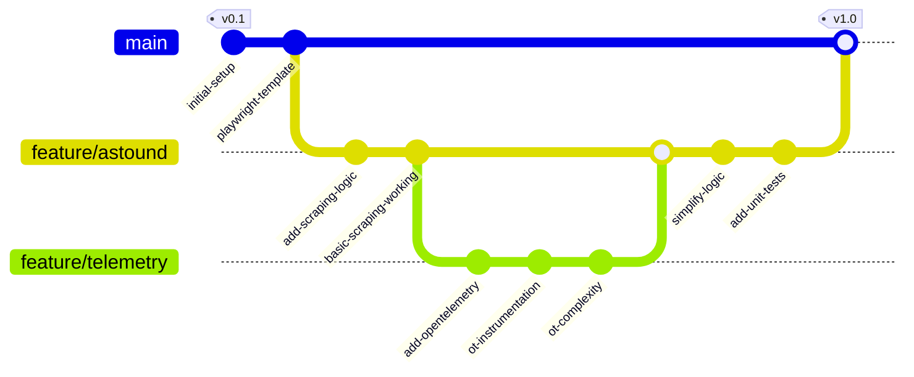
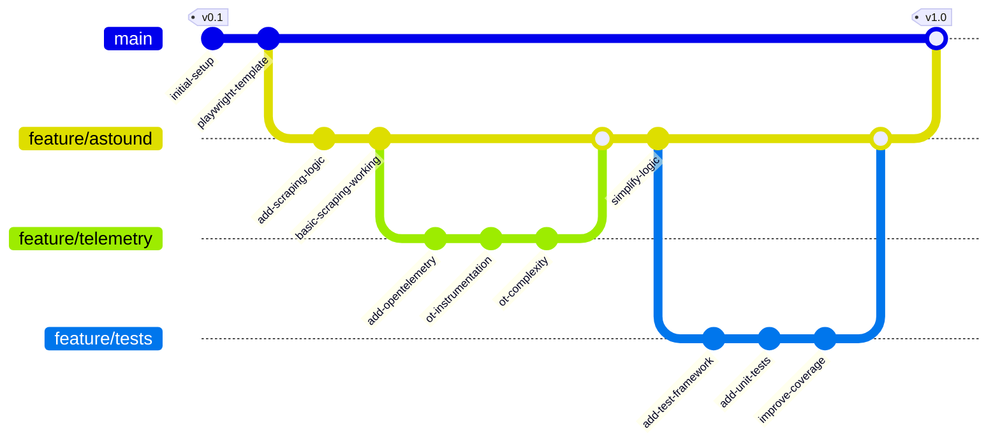
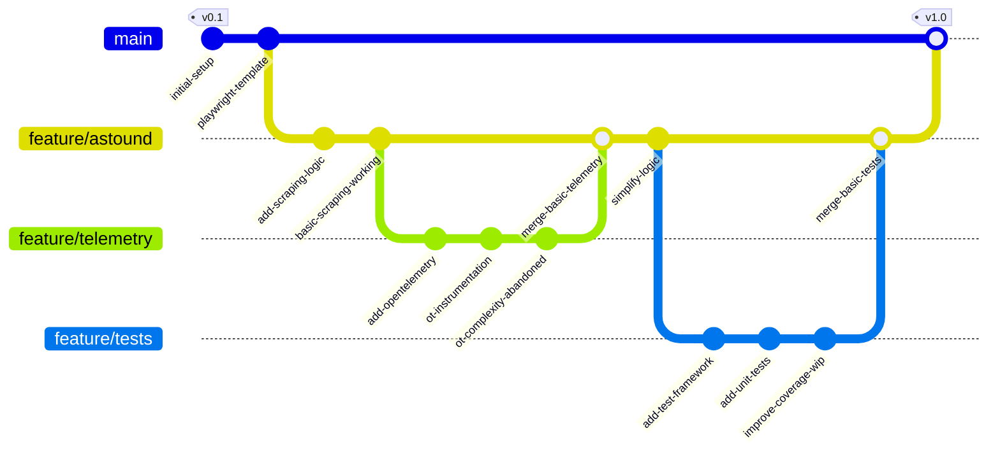
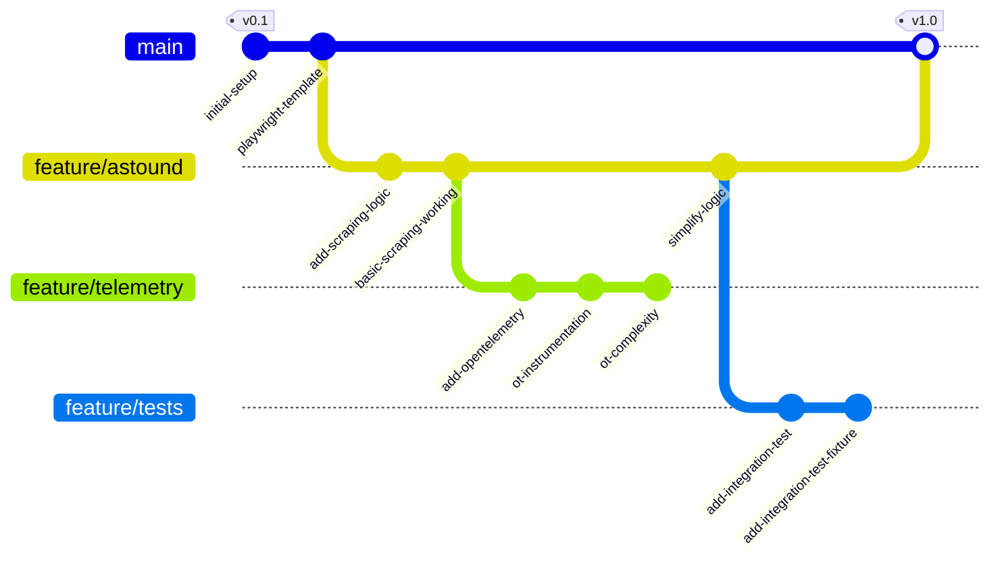

# Mermaid Mindmap Styling Examples

## Basic Mindmap


## Circle Nodes


## Square Nodes


## Mixed Node Types


## Deep Hierarchy


## With Emojis

```mermaid
mindmap
    root((🎯 Goals))
        🚀 Launch
            📅 Timeline
            ✨ Features
        💡 Ideas
            📱 Mobile
            🌐 Web
```



## Wide Structure


## Development Flow


## Technology Stack


## Project Timeline


```

These examples all work reliably on GitHub as they use only the core supported features:
1. Basic node types: `(())`, `[]`, `()`
2. Plain text nodes (no brackets)
3. Emoji support
4. Hierarchical structures
5. Multiple branches
6. Deep nesting

Note that GitHub's Mermaid implementation doesn't support:
- Custom colors
- Themes
- CSS classes
- Custom fonts
- Layout direction control
- Icons (other than emojis)
- Advanced node shapes like `{{}}` or `>>`

Would you like me to show more examples of working combinations?
```

# Astound Project Development Flow


# Astound Project Development Flow 2



# Astound Project Development Flow



Now the development flow shows:

1. Initial setup
2. Astound feature branch
3. Telemetry branch with complexity
4. Back to astound for simplification
5. Separate testing branch for proper test implementation
6. Final merge back to main

Is this closer to what you were envisioning?

# Astound Project Development Flow



Now the flow shows:

1. The complex OT work stays unmerged in feature/telemetry
2. Only the basic telemetry setup gets merged back
3. Similarly, only the basic test framework and unit tests get merged
4. The coverage improvements remain as work-in-progress in feature/tests

Is this a more accurate representation of the branches that were actually merged?

# Astound Project Development Flow



Now the flow shows:

1. Feature branches are created but never merged back
2. The feature/telemetry branch gets abandoned after complexity
3. The feature/tests branch remains separate with WIP coverage
4. Only the feature/astound work makes it back to main
5. No merges between feature branches

Is this closer to what you wanted? The telemetry and tests branches remain as separate, unmerged experiments?
